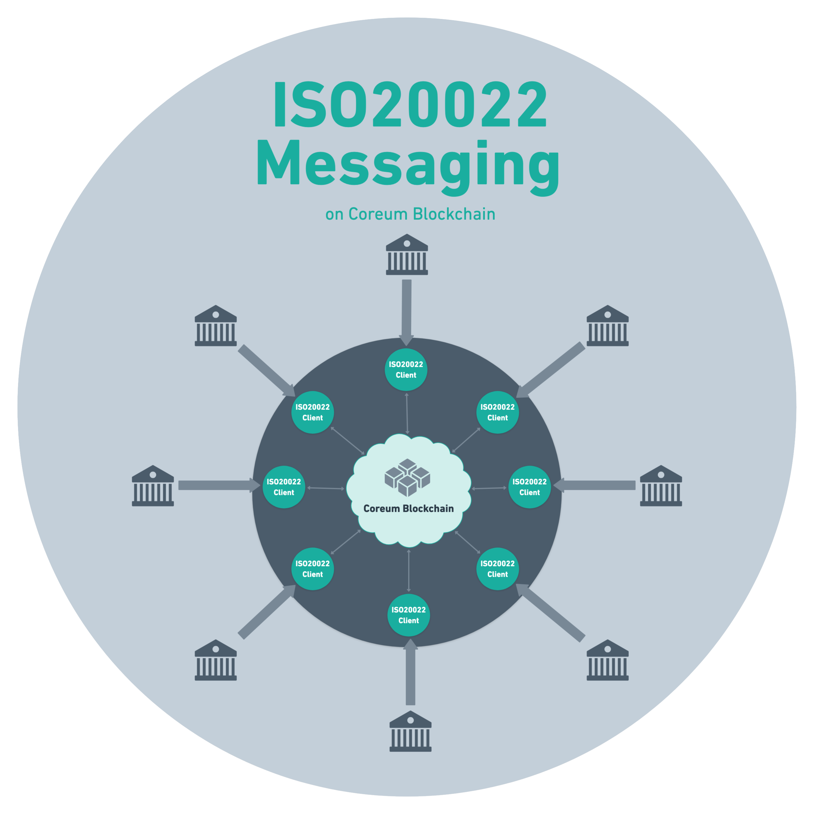
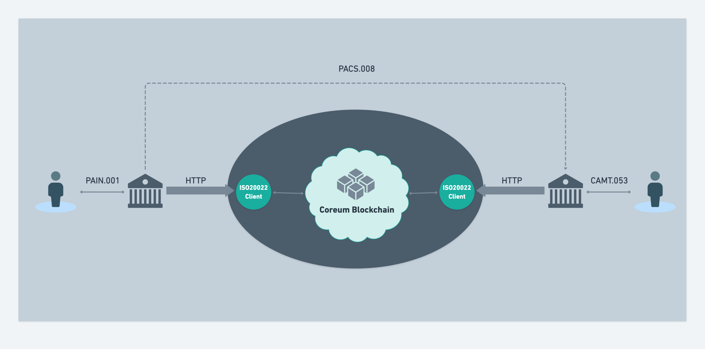

<div style="text-align: center">
    <h1>ISO20022 Client</h1>
</div>

<div style="text-align: center">
    
</div>

## Definitions

* **ISO20022**: As defined in [ISO20022 website](https://www.iso20022.org/):

> ISO20022 is a single standardization approach (methodology, process, repository)
> to be used by all financial standards initiatives.

* **ISO20022 messaging system**: A decentralized messenger connecting financial institutions,
  so they can pass their ISO20022 messages securely between each other,
  like [SWIFT](https://swift.com) in traditional banks.
  This system consists of a smart token deployed in a blockchain and a client application
  distributed between financial institutions to connect to the smart contract.

* **ISO20022 Client**: The application running on financial institutions'
  infrastructure that abstracts away all the complexities related to blockchain
  and acts as an HTTP server,
  so other applications in the institution can send and receive ISO20022 messages to or from it.

* **ISO20022 Message**: An XML file generated using financial applications (like accounting apps) using the ISO20022
  standard describing a financial operation like transferring credits.

## How It Works

### The Flow

The process of sending an ISO20022 message consists of 5 steps:

1. Reading and parsing the XML file of the message and extracting the Financial Institution Identity information of the
   recipient from each message
2. Finding the wallet address and public key of the recipient from the address book
3. Compressing the XML file and encrypting it with a symmetric key generated from the public key of the receiver and the
   private key of the sender using diffie-hellman key exchange method
4. Minting a NFT from the encrypted data
5. Sending the NFT information to the smart contract, so it can store it with sender and recipient address

The process of receiving an ISO20022 message consists of 7 steps:

1. Querying new messages periodically
2. Querying the NFT information of a received message
3. Decrypting the NFT data using the symmetric key generated from the public key of the sender and the private key of
   the recipient using diffie-hellman key exchange method and decompressing it
4. Parsing the XML file of the message and extracting the Financial Institution Identity information of the sender from
   the message
5. Finding the wallet address of the sender from the address book
6. Verifying if the sender of the message to the smart contract is the same with the sender in ISO20022 message
7. Writing the XML message to a file

### Example

<div style="text-align: center">
    
</div>

As a simple example, let's say one person (Debtor) has an account in one financial institution (Debtor Agent)
wants to transfer some credits to another person (Creditor) that has an account in another financial institution
(Creditor Agent).

The Debtor will send a `PAIN.001` (CustomerCreditTransferInitiation under Payment Initiation)
message to the Debtor Agent which is outside of scope of this project.
Then the Debtor Agent should transfer the credits to Creditor Agent, so the Creditor can receive the credit.

Both financial institutions are connected to the ISO20022 messaging system using the ISO20022 client application.
In traditional banking,
the `PACS.008` message should be sent to SWIFT application to be delivered to the other financial institution.
However, using this system,
it should be sent to the HTTP server that ISO20022 client is running either directly to the HTTP server,
or using the command line interface.
It then extracts the actual receiver of the message,
compresses and encrypts the message and delivers it to the smart contract.
The Creditor Agent is polling the smart contract periodically,
and it will receive the message that the Debtor Agent sent.
It will receive,
decrypt and decompress it and then the Creditor Agent can process the request and send a report to the Creditor using
`CAMT.053` (BankToCustomerStatement under Cash Management) which is also outside of scope of this project.

## Quick Start

If you want to get started quickly and learn how to interact with the application
first, you need to have the binary, initialize it, add your wallet key and register your institution.
Then you can start the application and interact with it.

### Download

You can download the latest build from [Releases](https://github.com/CoreumFoundation/iso20022-client/releases) page
of the repo according to your operating system (OS) and CPU architecture.

Or you can clone the project and make it using:

```bash
make build
```

It's better to either copy the binary to one the paths listed in your `PATH` environment variable
or add the binary directory to the `PATH` environment variable.

To see the directories listed in your `PATH` environment variable, you can run:

```bash
echo $PATH
```

### Initialize

When you want to work with the binary for the first time, you need to initialize it,
so it can generate the right configuration for the application.

Usually it's as easy as running:

```bash
iso20022-client init
```

But you have the option to configure it otherwise.
For example, if you want to connect to testnet instead of mainnet, you can run:

```bash
iso20022-client init --chain-id=coreum-testnet-1 --coreum-contract-address=testcore19a3m5sqm4s4mjfkpj3r7mg2q0gamjeh24zqlqqg6ezncv6l95q9qahxn93 --coreum-grpc-url=https://full-node.testnet-1.coreum.dev:9090
```

### Add Key

To be able to join the blockchain network, you need to have an account in Coreum blockchain.
To have that, you need to use a [wallet](https://docs.coreum.dev/docs/tools/wallets)
that is connected to Coreum mainnet and has enough funds to deliver messages.

Sending each message to the network costs some small tokens, the fund is necessary for this purpose.

Once you've created that, you can use the same mnemonics of the account in the ISO20022 Client,
so it can use the same account:

```bash
iso20022-client keys add iso20022-client --recover
```

Alternatively, you can generate the account in the ISO20022 Client:

```bash
iso20022-client keys add iso20022-client
```

And import the mnemonics to your wallet and fund your account.

### Register Your Institution

Each financial institution should be registered before being able to send or receive messages to the network.

To do so, you need to have the ISO20022 Financial Institution Identity information of your institute,
the wallet address and your public key.

After adding your key to the application in the previous step, it will show you an output like this:

```yaml
-   address: core1tagmslrz9xqfyjdddt6nu3q97us3ejck6475n8
    name: iso20022-client
    pubkey: '{"@type":"/cosmos.crypto.secp256k1.PubKey","key":"AqV7ob5PTCKOaiOp6iD6tQvjGorS6xLJiGQaVRBvQzM+"}'
    type: local
```

* The address written after the `address:` in the output is your wallet address.
* The `key` part of the `pubkey` is your public key.
* The ISO20022 Financial Institution Identity information is how you are identified in ISO20022 messages,
  which usually is using a Business Identification Code (BIC).

Now you need
to create a pull request on [Address Book](https://github.com/CoreumFoundation/iso20022-addressbook)
and add your information to it and wait for someone to validate your change and merge it.

For the example above, you need an entry like this to `addresses`:

```json
{
    "bech32_encoded_address": "core1tagmslrz9xqfyjdddt6nu3q97us3ejck6475n8",
    "public_key": "AqV7ob5PTCKOaiOp6iD6tQvjGorS6xLJiGQaVRBvQzM+",
    "party": {
        "identification": {
            "bic": "DDDDBEBB"
        }
    }
}
```

_TODO: Replace with Google Form when we have it._

Once your PR is merged, you can continue and start the application and interact with it.

_Note: You are not obligated to use our Address Book.
You can use our binary
to send message between nodes in a community you want which uses another address book
and change the address in the config file._

_TODO: Instruction for validation using company's domain._

### Start The Application

To start the application, you need to run:

```bash
iso20022-client start
```

It will start the HTTP server on port `2843` that receives ISO20022 messages in XML format
and delivers them to the smart contract deployed on blockchain.

If you open the same port of your local machine in your browser,
you can see the Swagger documentation of this HTTP server:

[http://127.0.0.1:2843/](http://127.0.0.1:2843/)

Usually the simple `start` command is enough to run the HTTP server,
but if you need to run it on another port, or use another key name, you can do so like this:

```bash
iso20022-client start --server-addr=':2844' --key-name=iso20022-client-2
```

The HTTP server should be running all the time, so you can interact with it.

### Send & Receive

Sending and receiving messages is done using HTTP requests like described in the Swagger API documentation,
but as an alternative, there are `send` and `receive` command line sub commands available in the binary.

Sending an ISO20022 message which is actually an XML file is done by:

```bash
iso20022-client message send /path/to/read/request.xml
```

Alternatively, if you have run your HTTP server using another port, you can do:

```bash
iso20022-client message send /path/to/read/request.xml --server-addr=':2843'
```

For receiving messages, you need to periodically run the `receive` sub command (or poll the HTTP endpoint):

```bash
iso20022-client message receive /path/to/write/response.xml
```

## Limitations

For the first PoC version, the only supported Business Area (BA) is Payments Clearing and
Settlement (PACS).

## What's Next

After the first PoC, we will implement an RTGS system that does the settlement between financial institutions using
digital tokens instead of fiat money.

## TODO

- [ ] Add new messages from [ISO20022 message definitions](https://www.iso20022.org/iso-20022-message-definitions).
- [ ] Add old messages
  from [ISO20022 message archive](https://www.iso20022.org/catalogue-messages/iso-20022-messages-archive).
